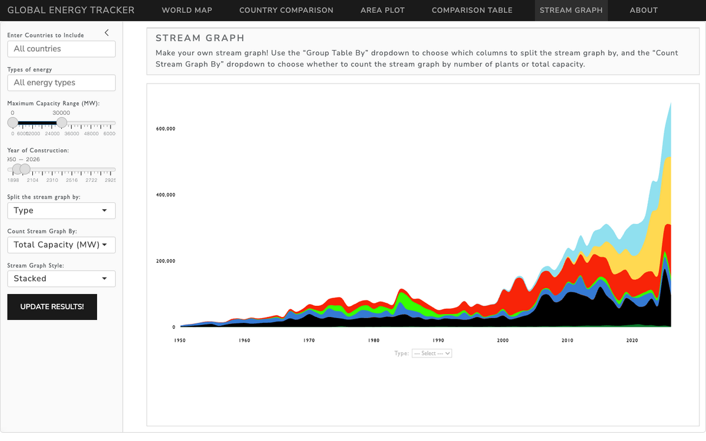
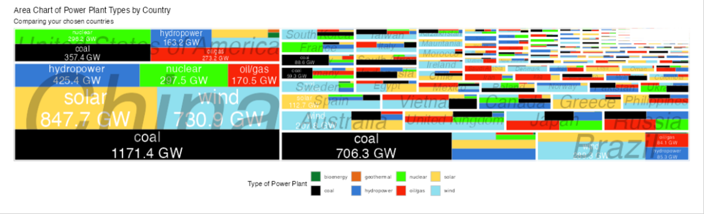

::: {.project-links}
<a class="btn btn-outline-primary" href="https://celotta.shinyapps.io/shinyappgrp10/"><i class="bi bi-box-arrow-up-right"></i>Live app</a>
:::

*A group project with Tyler Celotta for Data Science at Reed College.*

The Global Energy Tracker is an interactive Quarto dashboard with a Shiny backend. It covers roughly 67,000 power plants and lets users explore how the world's generating capacity has changed over time. Every page shares the same filters (country, energy type, plant capacity and construction year):

- **World map**: every plant, colored by energy type and sized by capacity, with an animated year slider
- **Country comparison**: side-by-side maps cropped to each chosen country's borders
- **Area plot**: capacity by type within each country, and a treemap of capacity across countries
- **Comparison table**: plant counts and capacity grouped by any combination of fields, with CSV download
- **Stream graph**: how new capacity has grown each year, split by type or any other field

It is built in R with Shiny, leaflet and leafgl, sf, plotly, treemapify and streamgraph. The plant data comes from Global Energy Monitor's *Global Integrated Power Tracker* (CC BY 4.0).

The source code is in a private course repository.
